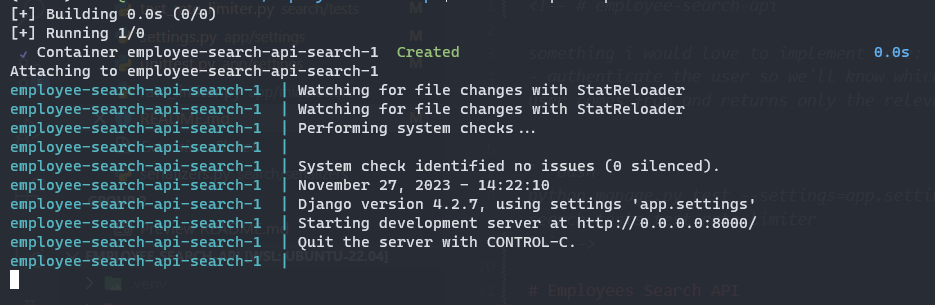
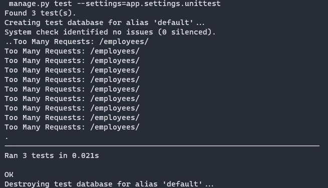

# Employees Search API
A small Django app to search for employee with dynamic information

# How to setup project
## Prerequisites
- Python `3.10`
- Django framework `4.2.7`
- Code formatting: Black
- Docker 24.0.2, build `cb74dfc`
- docker compose `v2.18.1`

## Steps
1. `git clone` this repo
2. `cd employee-search-api`
3. `docker compose up`  
If you see this screen, then the app is started successfully on port `8000`


# Deliverables
My `Employees` model is as follows:
```python
class Employees(models.Model):
    class EmployeeStatus(models.TextChoices):
        ACTIVE = "Active"
        NOT_STARTED = "Not started"
        TERMINATED = "Terminated"

    first_name = models.CharField(max_length=255, null=False)
    last_name = models.CharField(max_length=255, null=False)
    email = models.CharField(max_length=255, null=False, unique=True)
    telephone = models.CharField(max_length=255, blank=True, null=True)
    department = models.CharField(max_length=255, blank=True, null=True)
    position = models.CharField(max_length=255, blank=True, null=True)
    location = models.CharField(max_length=255, blank=True, null=True)
    status = models.CharField(max_length=255, null=False, choices=EmployeeStatus.choices)
    company = models.CharField(max_length=255, blank=True, null=True)
```

## Fetch all employees
```bash
curl --location 'localhost:8000/employees'
```

## Filter employees by some fields
Filter by field `first_name`
```bash
curl --location 'localhost:8000/employees/?first_name=John'
```
The API also supports search for many values or containing text with `first_name__in` or `first_name__icontains`:
```bash
curl --location 'localhost:8000/employees/?first_name__in=Jane,John'
```
```bash
curl --location 'localhost:8000/employees/?first_name__icontains=j'
```

## Request dynamic fields in response
If you only want the response to have the fields `department`, `location`, `position`, include a query param `fields` with the names of the fields you want:
```bash
curl --location 'localhost:8000/employees/?first_name__icontains=j&fields=department,location,position'
```

The response may look something like this:
```json
{
    "count": 4,
    "next": null,
    "previous": null,
    "results": [
        {
            "department": "HR",
            "position": "Manager",
            "location": "Seattle"
        },
        {
            "department": "Sales",
            "position": "Representative",
            "location": "Los Angeles"
        },
        {
            "department": "Marketing",
            "position": "Analyst",
            "location": "San Francisco"
        },
        {
            "department": "IT",
            "position": "Developer",
            "location": "New York"
        }
    ]
}
```

## Rate-limiting logic
Due to the time constraint, I tried to simplest form of rate limit:
- Try to limit users who send more than `100` requests in a span of `10` seconds (these numbers can be configured dynamically throught `settings.py`)
- Identify users by their IP address
- Use an in-memory object to store IP addresses and request count

### Some drawbacks to this approach
- Scalability: The in-memory approach doesn't work well in a distributed environment or under high load
- Persistence: If your server restarts, the data will be lost
- Accuracy: In a multi-process setup (like using gunicorn with multiple workers), this approach may not accurately track the rates

### Improvements
- Use Redis for more scalability and persistence
- Leverage Django REST Framework’s built-in throttling mechanisms
- Use more complex rate-limit algorithm: sliding window, token bucket or leaky bucket

## Tests
```bash
docker exec -it <your_container_name> python manage.py test --settings=app.settings.unittest
```


# Some possible improvements
- Authenticate the user so we'll know which company that user comes from and returns only the relevant results
- Implement caching for more performance
